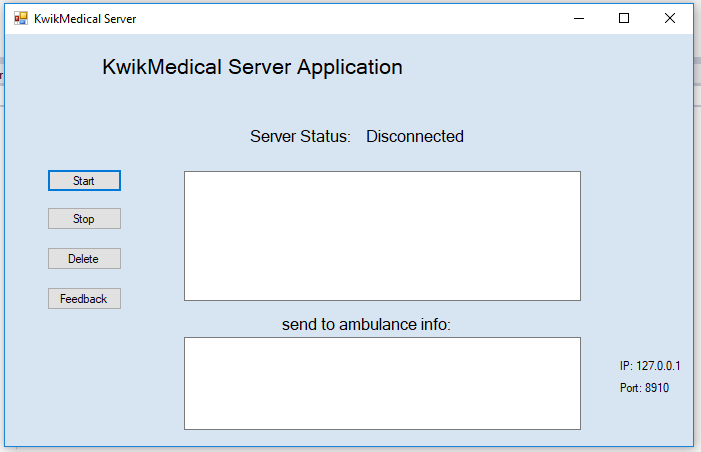
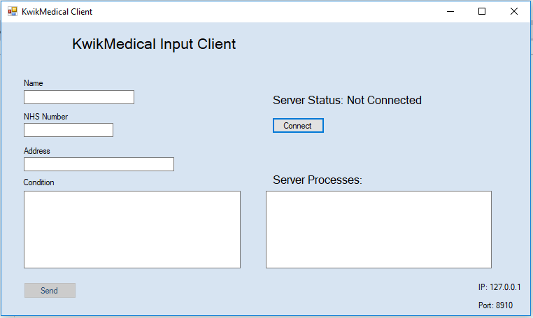
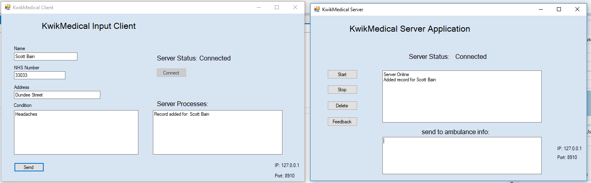

<h1>Server/Client Ambulance System using TCP/IP<h/1>

Application created in WPF to demonstrate the Client-Server model.

<h2>Server application</h2>

Acts as a server, first it must be Started. The IP and Port used are displayed in the bottom right.

<h2>Client application</h2>

Requires the server to be online in order to connect.

 

<h2>Communicating together</h2>

 

Once the server is online, the client can be connected. When connections are successful, the statuses will change to connected.

After this, the client can send requests to the server (in this case filling in a form with information and the client is notified when it's processed by the server). 

The system allows messaging via TCP/IP in a way that the server can process the data, in this case it is used to save in a database which would be used later on to set up an ambulance pick up. The ambulance would also be a client application.

