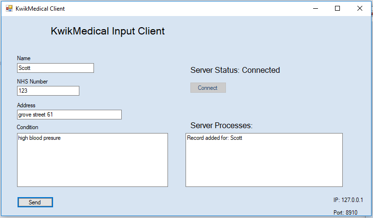
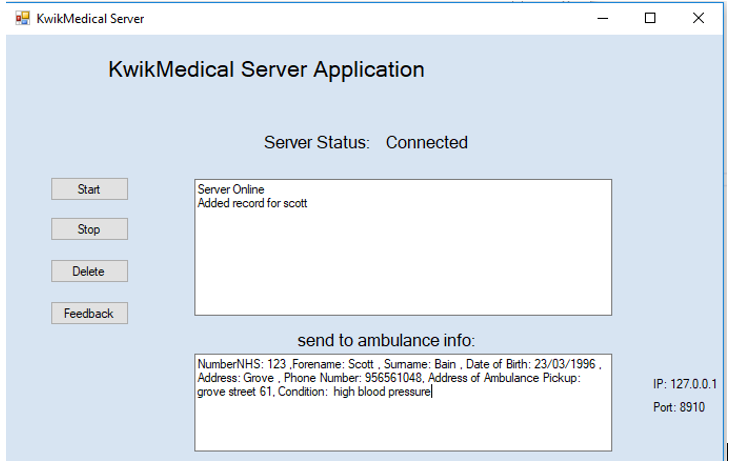

<h1>Server/Client Ambulance System using TCP/IP</h1>

Simple Application created in WPF to demonstrate the Client-Server model.

The goal of the system is to allow communication between different applications on a network.

The ambulance system will allow staff to register information such as patient name, NHS registration number, address and medical condition. This data will be used to determine which is the closest regional hospital and send out an ambulance. The system will then send the existing medical record and the case to a smart phone located in the ambulance.

<h2>Server application</h2>

Acts as a server, first it must be Started. The IP and Port used are displayed in the bottom right.

<h2>Client application</h2>

Requires the server to be online in order to connect.

 

<h2>Communicating together</h2>

Once the server is online, the client can be connected. When connections are successful, the statuses will change to connected.

After this, the client can send requests to the server (in this case filling in a form with information and the client is notified when it's processed by the server). 

The server as mentioned before processes the request, and by using the NHS number it obtains other information from the existing records available for the patient. All this information would then be sent to the nearest ambulance.

 

The ambulance would also be a client application that would communicate with the server application.

